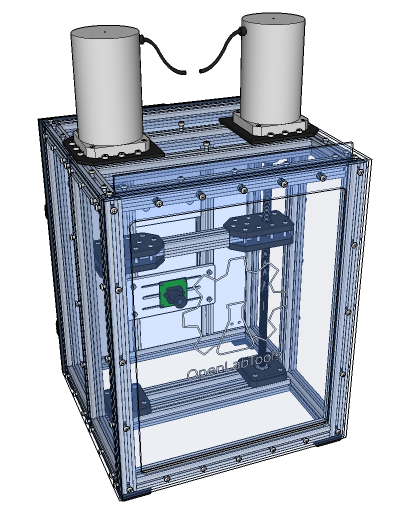
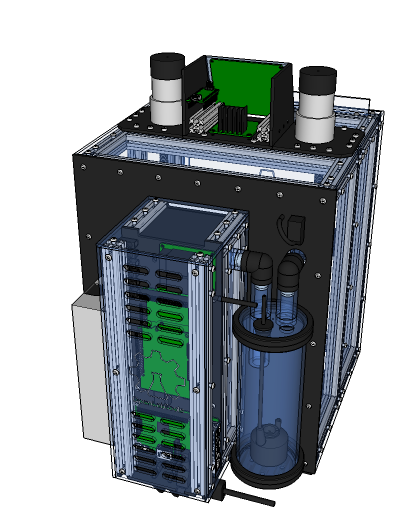

# OpenLabTools Mechanical Testing Machine

 

This is the repository for an open source mechanical testing machine with environmental control. A double glazed enclosure is built using OpenBeam extrusion and clear plastic panels as outlined [here](https://github.com/OpenLabTools/Resources-EnvironmentalChambers). Humidity control is achieved with a reservoir/chamber, ultrasonic mister, fan driven air flow and a servo controlled flap/valve. This is discussed further [here](https://github.com/OpenLabTools/Resources-HumidityControl). Temperature control is achieved using the same fan driven air flow system, resistive heating and multiple DS18B20 digital temperature sensors. This approach and alternatives to it are discussed [here](https://github.com/OpenLabTools/Resources-TemperatureControl).

A full Sketchup CAD model and panel outlines are in the [\cad](\cad) directory.
